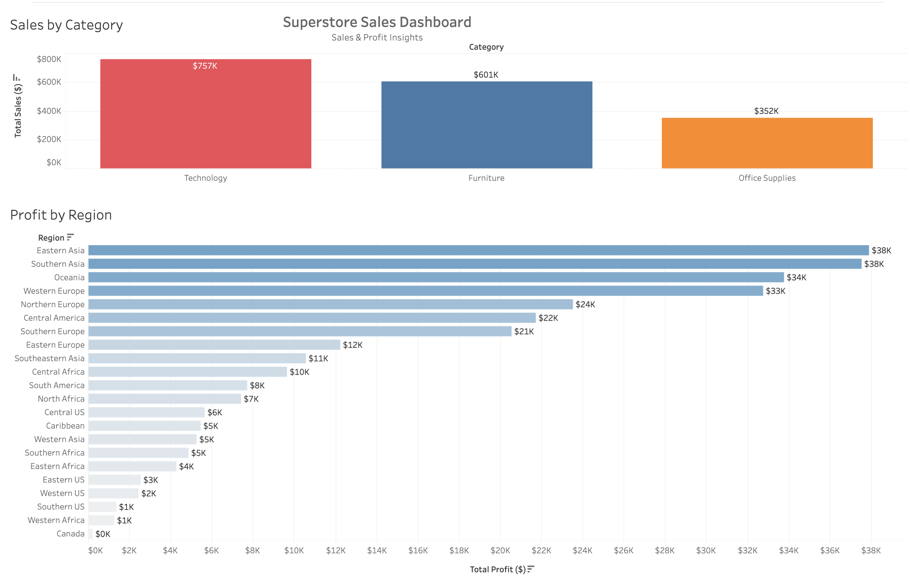

# 📊 Superstore Sales Dashboard

Interactive Tableau dashboard analyzing sales and profit performance across product categories and global regions.

## 🔗 Live Dashboard
[View Dashboard](https://public.tableau.com/app/profile/reveng.sairany/viz/SuperstoreSalesDashboard_17741221899430/Dashboard1)

## 📌 Key Insights
- Technology generated the highest sales (~$757K)
- Eastern Asia and Southern Asia were the most profitable regions
- Office Supplies had the lowest overall sales (~$352K)

## 🛠 Tools Used
- Tableau Public
- Data Visualization
- Dashboard Design

## 📷 Dashboard Preview

